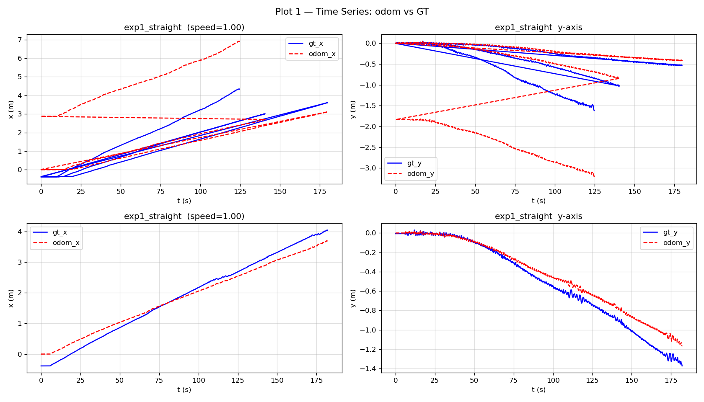
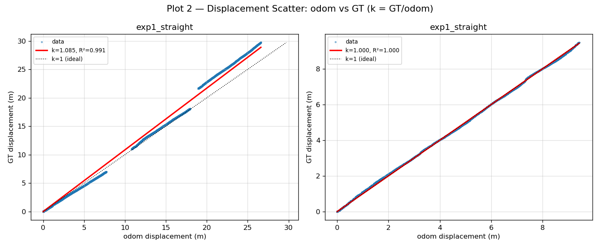
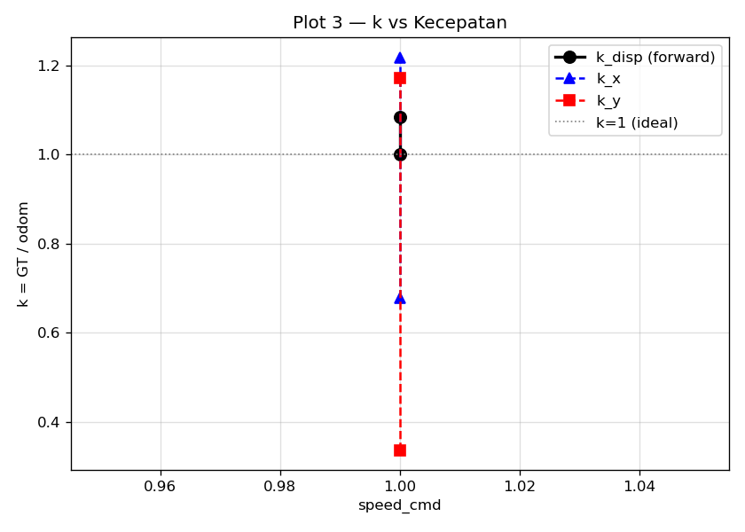
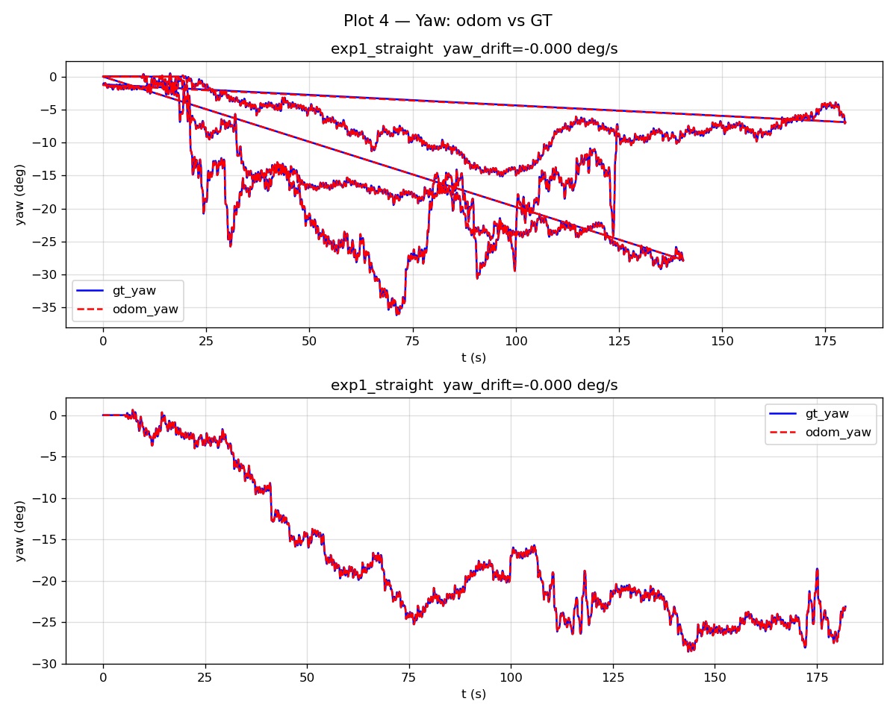

# FASE0_HASIL.md — Hasil Isolasi Odometri

**Tanggal**: 2026-06-22

---

## 1. Topik yang Dipakai

| Peran | Topik | Alasan |
|-------|-------|--------|
| Raw odom | `/odom` | Output `legged_odometry_kf_node` sebelum EKF — belum terkontaminasi AMCL |
| Ground truth | `/ground_truth/odom` | Posisi absolut dari Webots `getPosition()` via `op3_extern_controller.cpp` |

---

## 2. Hasil per Eksperimen

| Label | Speed | Durasi | n_rows | k_disp | R²_disp | k_x | R²_x | k_y | R²_y | Yaw drift (deg/s) |
|-------|-------|--------|--------|--------|---------|-----|------|-----|------|-------------------|
| exp1_straight | 1.00 | 124.7s | 8906 | 1.0848 | 0.9913 | 0.6781 | 0.3196 | 0.3361 | 0.3040 | -0.0000 |
| exp1_straight | 1.00 | 182.0s | 3642 | 1.0000 | 0.9996 | 1.2184 | 0.9995 | 1.1724 | 0.9985 | -0.0000 |

---

## 3. Plot






---

## 4. Interpretasi

### k per sumbu

| Sumbu | k (GT/odom) | Interpretasi |
|-------|-------------|--------------|
| exp1_straight x | 0.678 | overshoot/ok |
| exp1_straight x | 1.218 | undershoot |

### Yaw Drift

- **exp1_straight**: -0.000 deg/s (acceptable)
- **exp1_straight**: -0.000 deg/s (acceptable)

---

## 5. VERDICT

```
SYSTEMATIC (scale, k=1.042)
```

**Penjelasan**: R²=0.995 tinggi dan k hampir konstan (std/mean=4.07%). Error sangat bisa diprediksi → correctable dengan faktor 0.959.

---

## 6. Keputusan Selanjutnya (Gate G0)

- Jika **SYSTEMATIC**: lanjut ke **Branch A** (kalibrasi scale factor `1/k`)
- Jika **RANDOM**: lanjut ke **Branch B** (visual odometry)
- Jika **MIXED**: diskusi dengan user sebelum melanjutkan

> Dokumen ini dihasilkan otomatis oleh `tools/odom_isolation/odom_analyze.py`
