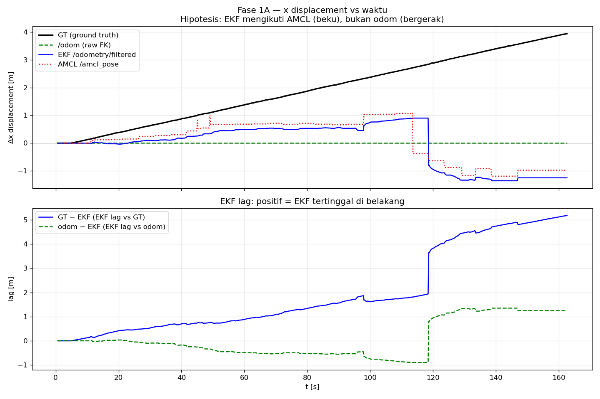
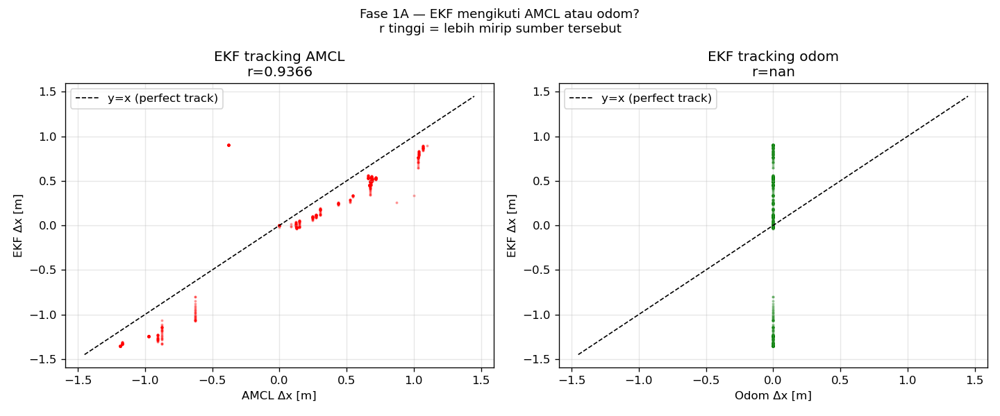
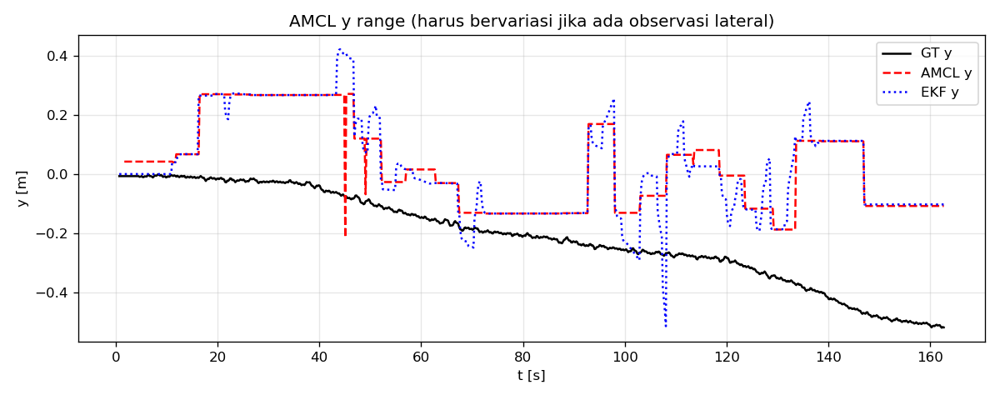
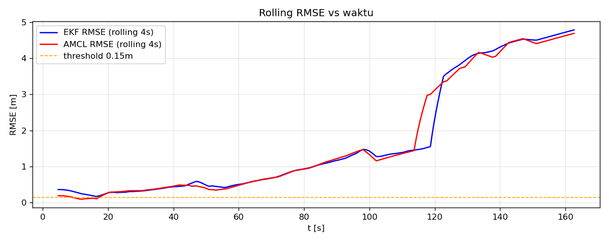

# FASE1A_HASIL.md — Diagnosa Supresi EKF

**Tanggal**: 2026-06-23
**Input CSV**: `pose_eval_footstep_cal.csv`

---

## 1. Ringkasan Data

| Metrik | Nilai |
|--------|-------|
| Jumlah baris | 811 |
| Durasi | 162.0s |

---

## 2. Korelasi Tracking EKF

| Pasangan | Pearson r | Interpretasi |
|----------|-----------|--------------|
| EKF vs AMCL | 0.9366 | tinggi → EKF ikut AMCL |
| EKF vs odom | nan | rendah → odom disuppress |
| odom vs GT  | nan  | kualitas odom mentah |

---

## 3. X-Capture % dan RMSE

| Source | X-capture % | RMSE [m] | Keterangan |
|--------|-------------|----------|-----------|
| EKF  | -31.6% | 2.3691m | output fusion |
| AMCL | — | 2.3736m | particle filter saja |
| odom | 0.0% | — | raw FK, tanpa fusion |

**EKF lag vs GT** di akhir run: 5.179m
**odom lag vs GT** di akhir run: 3.934m

---

## 4. AMCL y Range

AMCL x range (peak-to-peak): **2.285m**

Interpretasi: nilai < 0.1m berarti AMCL beku (tidak mendapat koreksi dari scan).

---

## 5. VERDICT

```
DATA TIDAK CUKUP
```

**Detail**: Tidak cukup data untuk menentukan.

---

## 6. Plot






---

## 7. Keputusan Selanjutnya (Gate G1)

- Jika **EKF SUPPRESSED**: lanjut ke Fase 1B — turunkan kepercayaan ke AMCL
  atau naikkan kepercayaan ke odom.
- Jika **EKF MIXED/ODOM**: sistem sudah berjalan benar, perbaiki sumber lain.

> Dihasilkan otomatis oleh `tools/ekf_diagnosis/ekf_analyze.py`